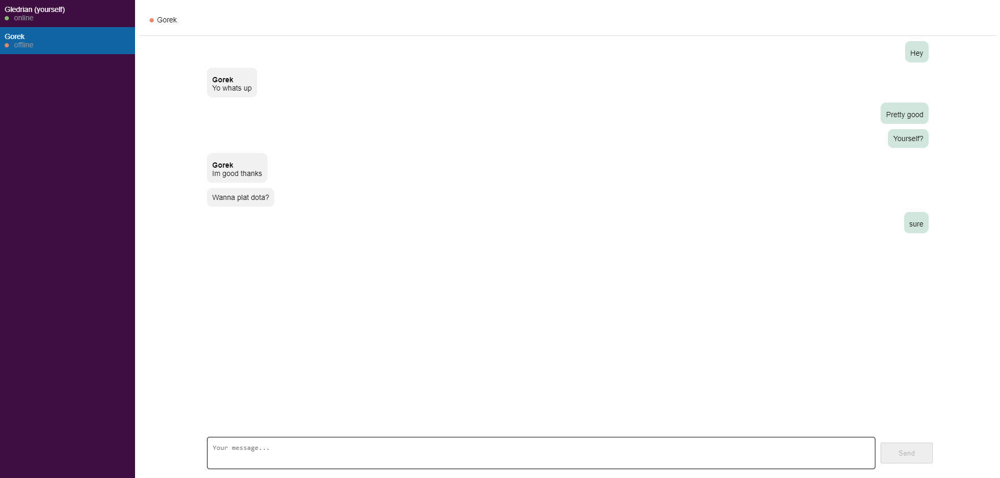

# Yappin 🗣 🗣 🗣

Yappin is a modern messaging app built with the **Vue framework** for the frontend and **Express** for the backend. It enables real-time chat capabilities using **Socket.IO** for bidirectional and low-latency communication.

The backend leverages **Node.js clustering** for load balancing and uses **Redis** as an adapter to propagate events across workers and cache recent messages.

---

## Features

-   **Real-time messaging** with low latency
-   **Scalable backend** using Node.js clusters
-   **Redis caching** for recent messages and event propagation

---

## Screenshot

Here’s a preview of how Yappin looks:



---

## What's Next

-   **User authentication**: Secure login with JWT or OAuth.
-   **Database integration**: Add PostgreSQL for storing archived messages.
-   **Production deployment**: Host on a cloud platform like AWS, Azure, or Heroku.

---

## Technologies Used

-   **Frontend**: Vue.js, Vite
-   **Backend**: Express, Socket.IO
-   **Database**: Redis (current), PostgreSQL (future)
-   **Load Balancing**: Node.js cluster
-   **Containerization**: Docker

---

## Demo

### Prerequisites

Ensure you have the following installed on your system:

-   **Docker**: [Download Docker](https://www.docker.com/get-started)
-   **Node.js**: [Download Node.js](https://nodejs.org/)
-   **npm**: Comes with Node.js installation.

### Steps

1. Run the Docker daemon.

2. Install dependencies for the backend:

    ```bash
    cd backend
    npm install
    ```

3. Start the local Redis client by running these commands in the same terminal:

    ```bash
    docker-compose up
    ```

4. **Open another terminal** and start the backend server:

    ```bash
    cd backend
    npm run start
    ```

5. **In another terminal**, install dependencies for the frontend:

    ```bash
    cd frontend
    npm install
    ```

6. Then start the frontend with:

    ```bash
    npm run dev
    ```

7. Open your browser and navigate to:

    ```
    http://localhost:5173
    ```

---

## License

[MIT](./LICENSE)
