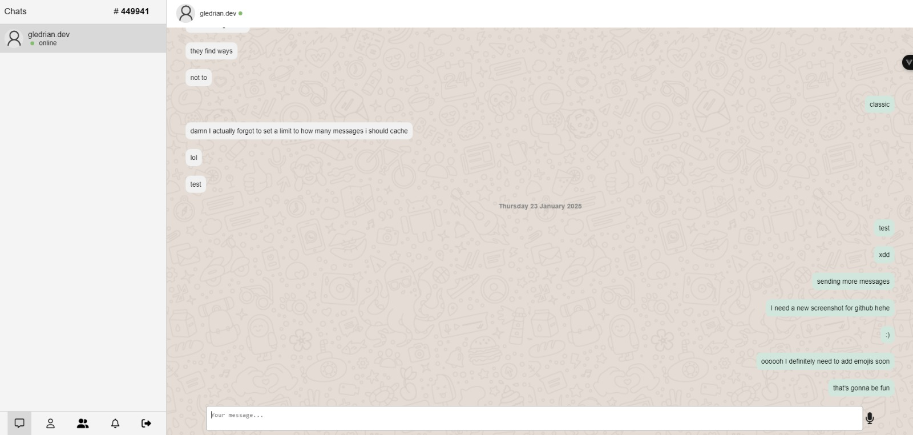

# Yappin 🗣 🗣 🗣

Yappin is an modern messaging app built with the **Vue framework**. It uses the **Socket.IO** library for bidirectional and low-latency communication.

## Purpose

This app is being developed solely for educational purposes. I'm just trying out different frameworks and sockets (Vue and SocektIO) and figuring out how messaging apps work.

## Live demo

You can check out a working demo of the app [here](https://yappin.vercel.app/).

Since anonymous logins have not been implemented yet, you'll have to "create" an account to test the app.

Account creation takes two simple steps:

1. Invent a fake email with a valid format. For example, acb@email.com

2. Think up of a password. One character will suffice (obviously prone to brute force attacks but hey I don't want this to be tedious). Oh btw passwords are encrypted, I'm not stupid luckily 😏

That's it, you're good to go 😁👍

Tip: the id on the left panel is what your friend would need, to add you as a friend. To test the messaging features by yourself, you'll have to open the app in a private window and register another account. This way you are logged in as two different users.

Please note that every cloud service needed to run this app is running on free tier so I'll have to wipe its data once in a while.

---

## Features

-   **Real-time messaging** with low latency
-   **Redis caching** for recent messages and event propagation

---

## Screenshot

Here’s a preview of how Yappin looks:

---

## What's Next

-   Automatically create anonymous accounts that lasts 1 day on a click of a button
-   Improve UI for smaller devices
-   Encrypt messages
-   Add emojis
-   Add voice messages
-   Ability to send images or videos

## Technologies Used

-   **Frontend**: Vue.js, Vite
-   **Backend**: Express, Socket.IO
-   **Database**: Redis, PostgreSQL
-   **Development**: Docker
-   **Media management service**: Cloudinary

---

## Local Demo

Rather than giving you a step by step guide on how to run this marvelous app on your machine, I'll just dockerize the whole app in the future so it can be done in a single of a command.

## License

[MIT](./LICENSE)
